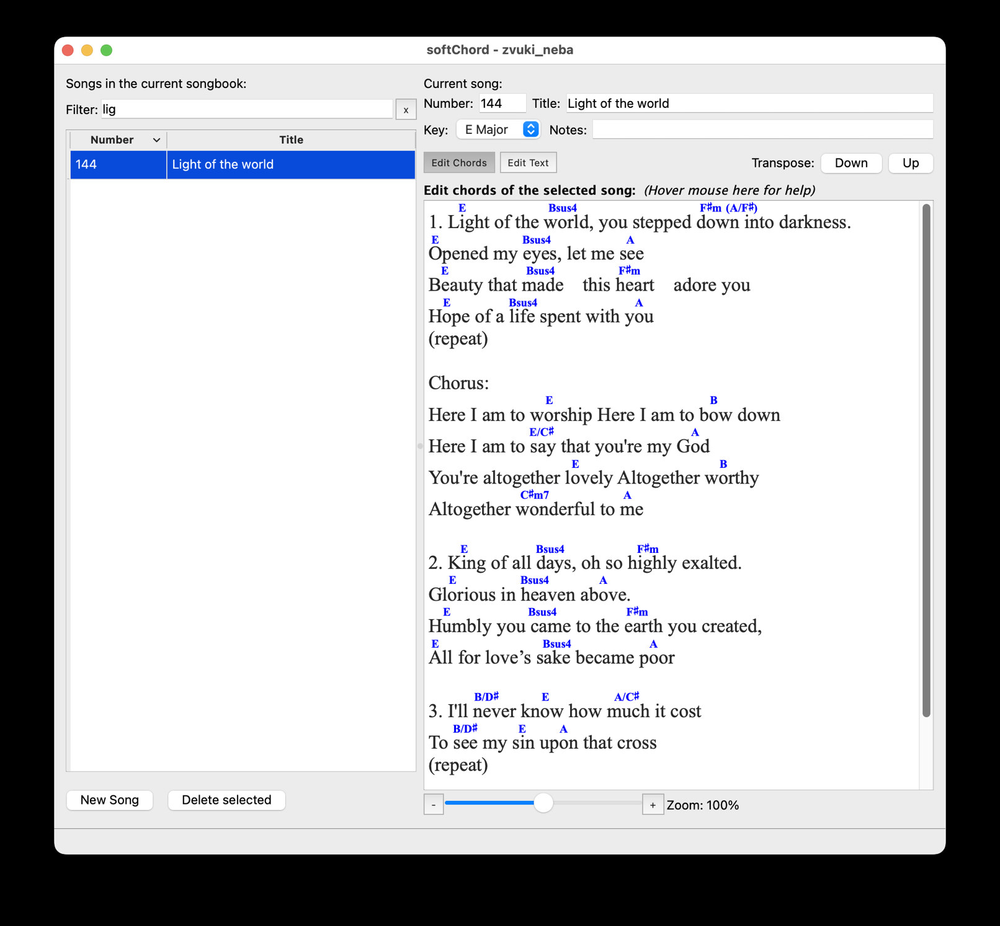

# softChord

A cross-platform editor for songs with chords. Chords are attached to individual letters in the lyrics (not lined up with spaces), so they stay in place as you edit. Songs are stored together in a songbook file.



## Features

- Edit lyrics and chords in a simple desktop UI
- Store many songs in one `.songbook` file
- Chords move automatically when lyrics change
- Transpose songs
- Use any font or size for lyrics and chord symbols
- Import and export plain text (chords aligned automatically)
- Import and export [ChordPro](https://www.chordpro.org/)
- Export / print to PDF
- Unicode (UTF-8) lyrics
- Song search

The app is written in Python with [PyQt6](https://www.riverbankcomputing.com/software/pyqt/). PyQt6 bundles Qt, so a separate Qt SDK is not required.

## Running from source

Requires [Python](https://www.python.org/) 3.10 or newer.

```bash
git clone https://github.com/matvey83/softChord.git
cd softChord
./start_softChord.py
```

On Windows:

```bat
python start_softChord.py
```

To open a songbook at launch:

```bash
./start_softChord.py zvuki_neba.songbook
```

`start_softChord.py` creates a `.venv` virtual environment if needed, installs dependencies from `requirements.txt`, and starts the app. It asks before installing packages.

macOS builds are on [GitHub Releases](https://github.com/matvey83/softChord/releases). Older 0.9.x binaries (2011–2013) remain on [SourceForge](https://sourceforge.net/projects/softchord/).

## Development

### Manual setup

The launcher above is enough for most work. To set up the venv by hand:

```bash
python3 -m venv .venv
source .venv/bin/activate          # Windows: .venv\Scripts\activate
pip install -r requirements.txt
```

Then run either `./start_softChord.py` or:

```bash
.venv/bin/python src/softchord.py
```

`.venv` is listed in `.gitignore`.

To pick up changes to `requirements.txt`:

```bash
pip install -r requirements.txt
```

### Tests

Run from `src/` with the venv active (so `import softchord` works):

```bash
cd src
python3 test_song.py          # unit tests
python3 softchord_test.py     # integration tests (starts a Qt application)
```

### Regenerating UI modules

Windows are defined in Qt Designer `.ui` files. After editing them, regenerate the Python modules:

```bash
pyuic6 src/softchord_main_window.ui -o src/softchord_main_window_ui.py
pyuic6 src/softchord_chord_dialog.ui -o src/softchord_chord_dialog_ui.py
pyuic6 src/softchord_pdf_dialog.ui -o src/softchord_pdf_dialog_ui.py
```

Do not edit the generated `*_ui.py` files by hand.

## Packaging

Standalone builds use [PyInstaller](https://pyinstaller.org/) 6 from `softchord.spec`. GitHub Actions (`.github/workflows/build.yml`) builds Apple Silicon and Intel macOS `.app` zips plus a Windows `.exe` on tagged releases, or on demand via **Actions → Build → Run workflow**.

You can also build locally. Build **on the OS you want to ship** (a Mac cannot produce the Windows `.exe`, and vice versa).

```bash
./build_softChord.py
```

On Windows:

```bat
python build_softChord.py
```

The helper uses `.venv`, installs `requirements.txt` and `requirements-build.txt`, then runs PyInstaller. Equivalent manual steps:

```bash
source .venv/bin/activate          # Windows: .venv\Scripts\activate
pip install -r requirements.txt
pip install -r requirements-build.txt
pyinstaller --noconfirm --clean softchord.spec
```

| Platform | Local output | CI release asset |
|---|---|---|
| macOS (Apple Silicon) | `dist/softChord.app` | `softChord-*-macos-arm64.zip` |
| macOS (Intel) | `dist/softChord.app` | `softChord-*-macos-x86_64.zip` |
| Windows | `dist/softChord.exe` | `softChord-*-windows.exe` |

`.songbook` files are associated with the app:

- **macOS:** the bundle `Info.plist` declares the type so Finder can open `.songbook` files with softChord.
- **Windows:** the frozen exe registers the extension for the current user on launch (no installer or admin rights). Double-clicking a `.songbook` then starts this copy of `softChord.exe`.

The Mac `.app` is ad-hoc signed by PyInstaller. To distribute to other Macs you still need a Developer ID signature, notarization (`xcrun notarytool`), and typically a DMG. The Windows `.exe` is unsigned; an Authenticode certificate reduces SmartScreen warnings.

Do not commit `build/` or `dist/` (they are gitignored).
